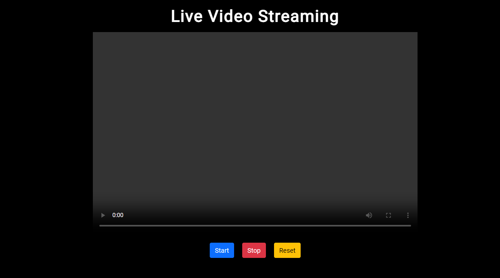
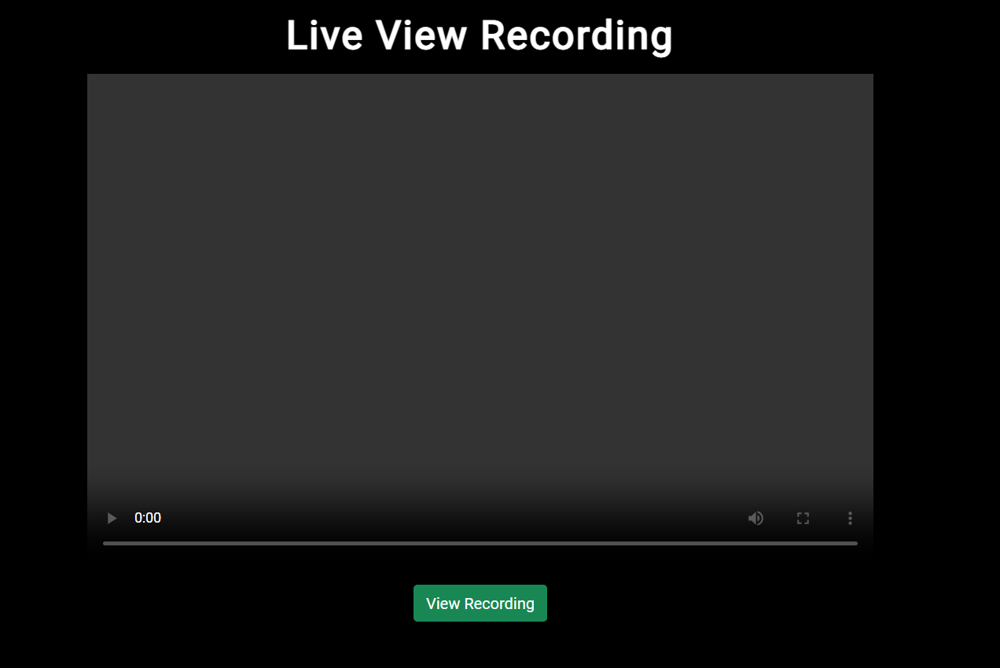
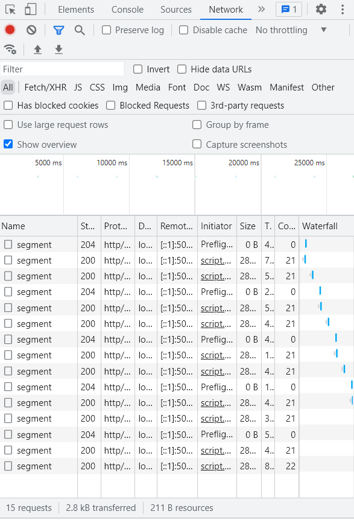
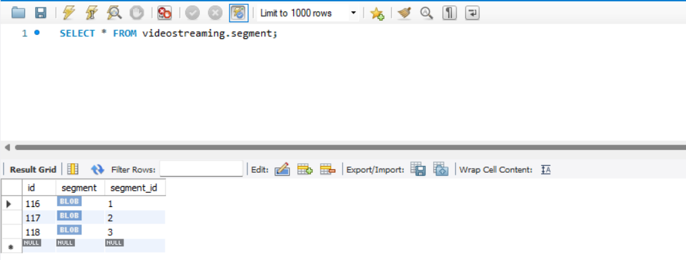

# Application/Transport Layers (A Video Streaming Application)

## Team10:
#### Dinesh Kini Bailoor 40231799
#### Sindoora Rao 40199155
## Username on host Server:
#### team10


### Install the following dependencies

#### Node

```bash
$ curl -o- https://raw.githubusercontent.com/nvm-sh/nvm/v0.39.1/install.sh | bash
$ nvm install lts/gallium
$ nvm use
```

#### MySQL
```bash
https://www.mysql.com/downloads/
```

### Setup project

Clone Repository (`https://github.com/dinesh-07/cn-video-stream.git`)
```bash
$ git clone https://github.com/dinesh-07/cn-video-stream.git
```

#### Install Server Dependency
```bash
$ cd server
$ npm install
```

#### Start Server
```bash
$ npm start
```

#### Open Client file for live recording
```bash
$ cd client
$ index.html
```

#### Open Client file for watch live recording
```bash
$ cd client
$ view.html
```
### Demo

#### Live Recording


#### Live Watch


#### Live Video Segmentation


#### Save segment on database


### Description

#### Client Side
```bash
We have used a Webm media recorder.
Briefly our client has the following methods:
1. StartFunction : Is entry point to the application functionality. Executes when user clicks on start button in index.html. This method, internally calls gotMedia which holds the client side logic for segmenting and related calls for uploading video to server.
2. gotMedia : This method has all the business logic.To explain breifly, gotMedia is responsible for, initializing the instances required for media recording, adding the event data(recorded video) to a datastructure, running a setInterval method for every 3 seconds. Inside setInterval, we perform segmentation of the video, make it a BLOB and upload it into database via POST method.
3. Stop : Executed when client clicks on stop button on index.html page. Responsible for wrapping up tasks such as stopping the media recorder instance,streams,clearing the recording intervals
4. Reset : Called when client clicks on Reset button. The method simple resets the server database
5. View : This method is assiciated with the view button on view.html file. It is responsible for fetching the video from the server and playing it on client side. For now we are just fetching the first segment.As a part of next lab assignment we will be implementing the part of fetching all the segments from database and playing on the client side.
6. Download : We have added this extra functionality at the client side that downloads the video segement as and when we upload it to database. This we have included for our purpose of testing. This can be removed in the last deliverable.
```
#### Server Side
```bash
Our Server is responsible for the following tasks :
1. Setting up the MySQL database connection.
2. Creating Database, creating a table to store the database.
3. Uploading segments on to the databse by performing insert query whenever POST method is called at the client side.
4. Fetching the segments performing query when user clicks on view.
```

